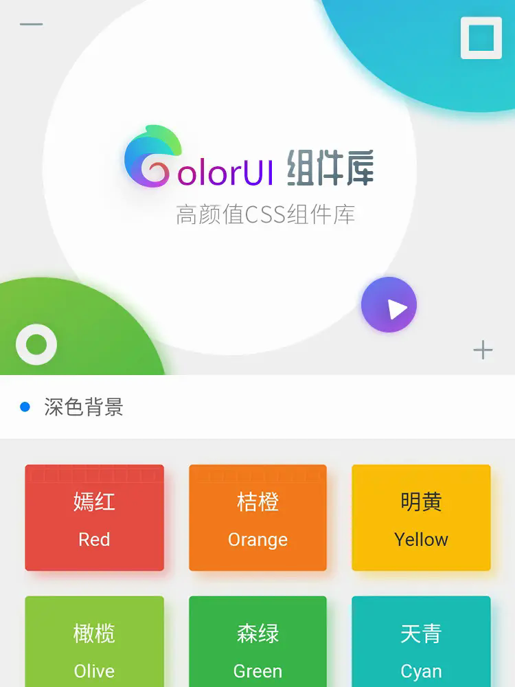
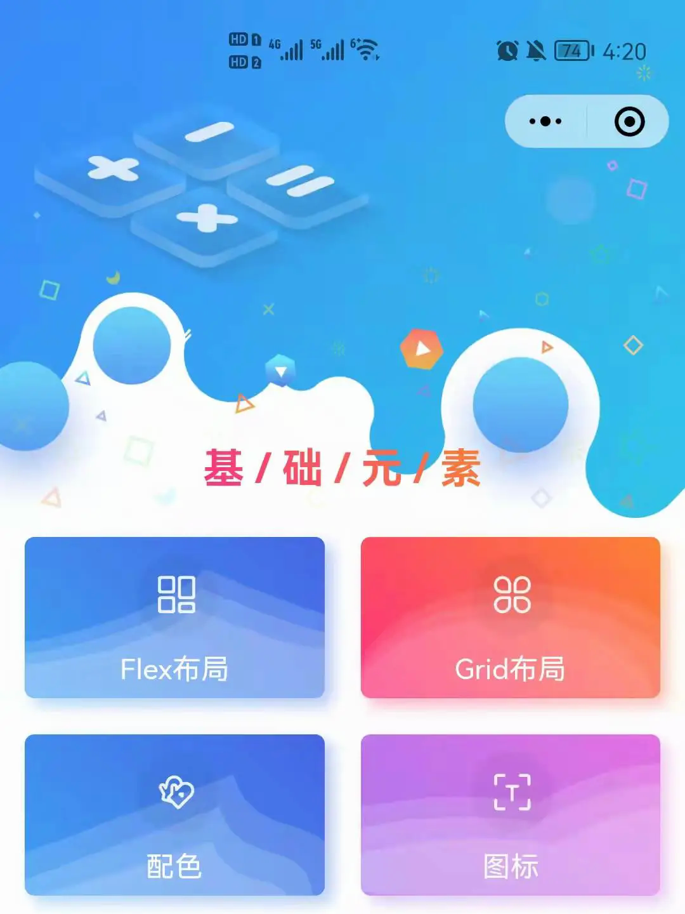
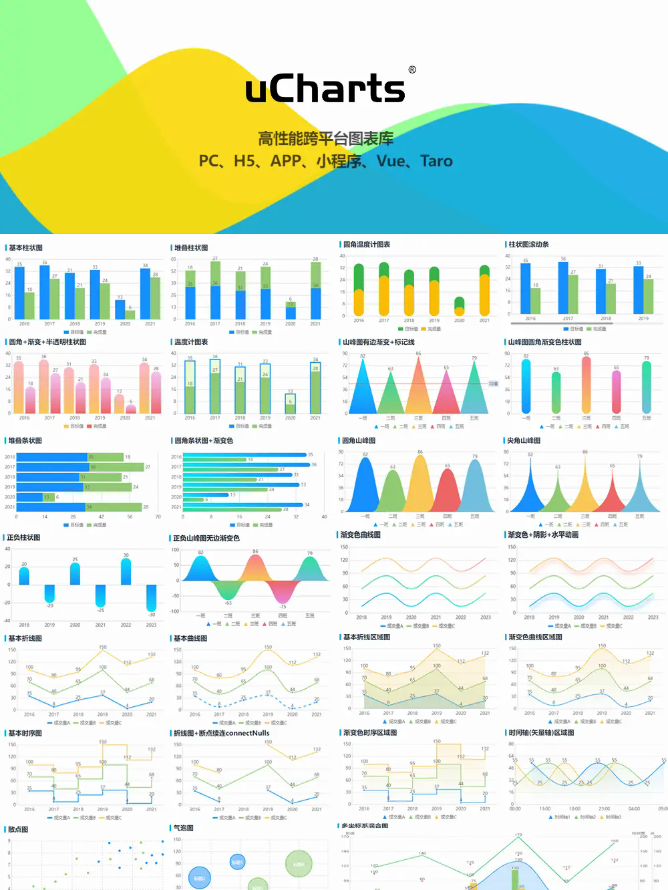
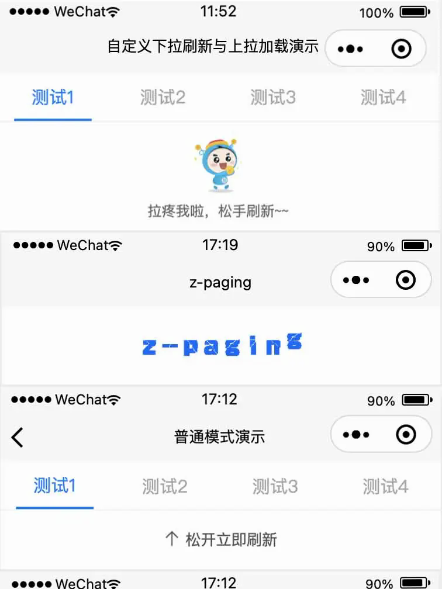
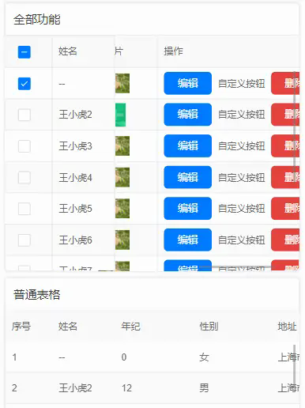
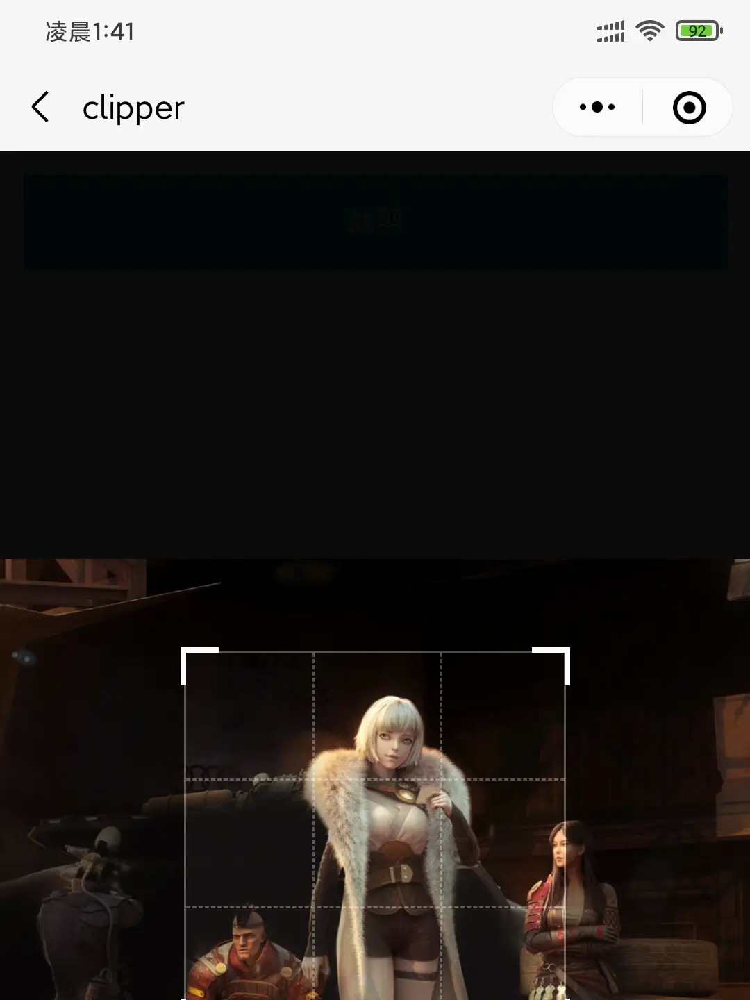
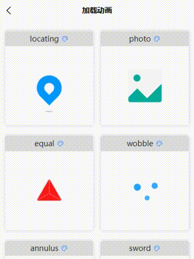
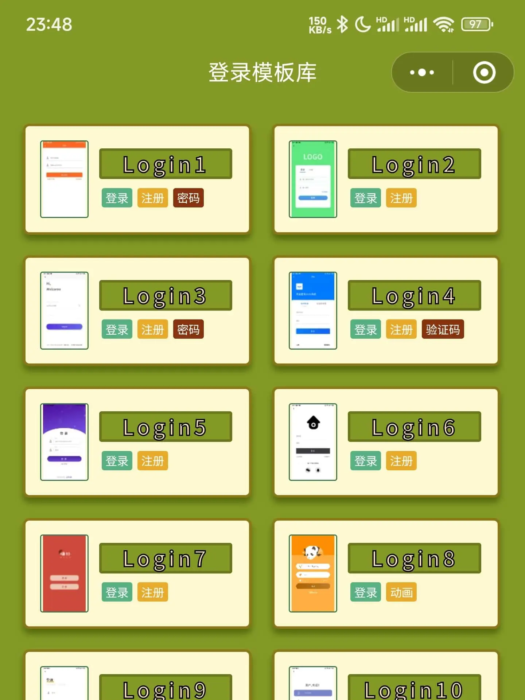

# uniapp 插件精选

收集 uni-app 开发中常用、体验优秀的组件、插件、UI 框架和项目模板。条目综合插件市场的下载、收藏、更新和评价等信息筛选而来。

> 除 VSCode 插件外，所有条目均附有官方简介；插件市场提供预览图时，展示其首张预览图。标题下方的“适用”标签提炼自官方简介，并以 Shields 徽章展示，便于快速选型。每项均提供醒目的“查看详情 →”链接，名称和图片同样可点击。
>
>  等徽章表示条目的运行环境、技术栈或功能场景。

## 目录

- [UI 框架（10）](#ui-框架10)
- [功能组件（21）](#功能组件21)
- [项目模板（6）](#项目模板6)
- [VSCode 插件推荐](#vscode-插件推荐)

## UI 框架（10）

<table>
  <tr><td width="112" align="center"></td><td valign="top"><strong><a href="https://ext.dcloud.net.cn/plugin?id=55">uni-ui</a></strong> <small>适用：</small>   基于 uni-app 的全端兼容、高性能 UI 框架。 <a href="https://ext.dcloud.net.cn/plugin?id=55">查看详情 →</a></td></tr>
  <tr><td align="center"></td><td valign="top"><strong><a href="https://ext.dcloud.net.cn/plugin?id=239">color-ui</a></strong> <small>适用：</small>   适用于 H5、微信小程序、Android、iOS 和支付宝的高颜值、高度可自定义 CSS 组件库。 <a href="https://ext.dcloud.net.cn/plugin?id=239">查看详情 →</a></td></tr>
  <tr><td align="center"></td><td valign="top"><strong><a href="https://ext.dcloud.net.cn/plugin?id=1593">uView2.0</a></strong> <small>适用：</small>   兼容 nvue，提供全面组件和便捷工具。 <a href="https://ext.dcloud.net.cn/plugin?id=1593">查看详情 →</a></td></tr>
  <tr><td align="center"></td><td valign="top"><strong><a href="https://ext.dcloud.net.cn/plugin?id=12287">uv-ui</a></strong> <small>适用：</small>   基于 uni-app、部分组件基于 uView2.x 的全端兼容 UI 框架，支持独立导入。 <a href="https://ext.dcloud.net.cn/plugin?id=12287">查看详情 →</a></td></tr>
  <tr><td align="center"></td><td valign="top"><strong><a href="https://ext.dcloud.net.cn/plugin?id=8744">uview-plus</a></strong> <small>适用：</small>   兼容 Vue 3 和多语言的移动组件库，提供 120+ 组件及排序、条码、裁剪等能力。 <a href="https://ext.dcloud.net.cn/plugin?id=8744">查看详情 →</a></td></tr>
  <tr><td align="center"></td><td valign="top"><strong><a href="https://ext.dcloud.net.cn/plugin?id=24021">uview-next</a></strong> <small>适用：</small>   基于 uView UI 2.0 的 110+ 高质量组件库，支持 Vue 2、Vue 3、鸿蒙与多语言。 <a href="https://ext.dcloud.net.cn/plugin?id=24021">查看详情 →</a></td></tr>
  <tr><td align="center"></td><td valign="top"><strong><a href="https://ext.dcloud.net.cn/plugin?id=13889">wot-ui</a></strong> <small>适用：</small>   基于 Vue 3 与 TypeScript 的 uni-app 组件库，提供 70+ 组件并支持暗黑模式、国际化和主题定制。 <a href="https://ext.dcloud.net.cn/plugin?id=13889">查看详情 →</a></td></tr>
  <tr><td align="center"></td><td valign="top"><strong><a href="https://ext.dcloud.net.cn/plugin?id=7088">tuniao-ui</a></strong> <small>适用：</small>   基于 uni-app 的 UI 框架，支持 App、H5、微信小程序，并提供组件和页面模板。 <a href="https://ext.dcloud.net.cn/plugin?id=7088">查看详情 →</a></td></tr>
  <tr><td align="center"></td><td valign="top"><strong><a href="https://ext.dcloud.net.cn/plugin?id=16001">sard-uniapp</a></strong> <small>适用：</small>   一套基于 UniApp 和 Vue 3 开发、兼容多端的 UI 组件库。 <a href="https://ext.dcloud.net.cn/plugin?id=16001">查看详情 →</a></td></tr>
  <tr><td align="center"></td><td valign="top"><strong><a href="https://ext.dcloud.net.cn/plugin?id=25431">tdesign-uniapp</a></strong> <small>适用：</small>  TDesign Component for uniapp。 <a href="https://ext.dcloud.net.cn/plugin?id=25431">查看详情 →</a></td></tr>
</table>

## 功能组件（21）

按开发任务分组，方便从场景开始筛选。

<table>
  <tr><td colspan="2"><strong>数据与网络</strong> <small>图表、请求与列表加载</small></td></tr>
  <tr><td align="center"></td><td valign="top"><strong><a href="https://ext.dcloud.net.cn/plugin?id=271">ucharts 图表</a></strong> <small>适用：</small>   支持在 H5 和 App 以 uCharts、ECharts 渲染图表的跨端可视化组件。 <a href="https://ext.dcloud.net.cn/plugin?id=271">查看详情 →</a></td></tr>
  <tr><td align="center"></td><td valign="top"><strong><a href="https://ext.dcloud.net.cn/plugin?id=4899">echarts 图表</a></strong> <small>适用：</small>   为 UniApp 提供 ECharts 兼容支持，让图表可运行于 H5、小程序和 App。 <a href="https://ext.dcloud.net.cn/plugin?id=4899">查看详情 →</a></td></tr>
  <tr><td align="center"></td><td valign="top"><strong><a href="https://ext.dcloud.net.cn/plugin?id=343">高性能下拉刷新上拉加载</a></strong> <small>适用：</small>   通过 wxs 与 renderjs 实现，支持原生页面、局部滚动及 Vue 3 script setup。 <a href="https://ext.dcloud.net.cn/plugin?id=343">查看详情 →</a></td></tr>
  <tr><td align="center"></td><td valign="top"><strong><a href="https://ext.dcloud.net.cn/plugin?id=3935">z-paging 下拉刷新、上拉加载</a></strong> <small>适用：</small>   低耦合的全平台分页组件，支持下拉刷新、加载更多、虚拟列表和聊天分页等配置。 <a href="https://ext.dcloud.net.cn/plugin?id=3935">查看详情 →</a></td></tr>
  <tr><td align="center"></td><td valign="top"><strong><a href="https://ext.dcloud.net.cn/plugin?id=392">luch-request 网络请求库</a></strong> <small>适用：</small>   基于 Promise 的跨平台、项目级请求库，面向传统 uni-app 的 TypeScript-first 请求库。 <a href="https://ext.dcloud.net.cn/plugin?id=392">查看详情 →</a></td></tr>
  <tr><td align="center"></td><td valign="top"><strong><a href="https://ext.dcloud.net.cn/plugin?id=7511">zb-table 多功能表格</a></strong> <small>适用：</small>   支持固定表头和列、加载、排序、多选、编辑与合计的多功能跨端表格组件。 <a href="https://ext.dcloud.net.cn/plugin?id=7511">查看详情 →</a></td></tr>
  <tr><td colspan="2"><strong>页面与交互</strong> <small>页面效果与用户操作</small></td></tr>
  <tr><td width="112" align="center"></td><td valign="top"><strong><a href="https://ext.dcloud.net.cn/plugin?id=2389">海报画板</a></strong> <small>适用：</small>   一款 canvas 海报组件，提供更优雅的海报生成方案，有限支持富文本。 <a href="https://ext.dcloud.net.cn/plugin?id=2389">查看详情 →</a></td></tr>
  <tr><td align="center"></td><td valign="top"><strong><a href="https://ext.dcloud.net.cn/plugin?id=3499">lucky-canvas 抽奖插件</a></strong> <small>适用：</small>   可配置奖品、文字、图片、颜色与按钮，支持同步或异步抽奖及前后端概率控制。 <a href="https://ext.dcloud.net.cn/plugin?id=3499">查看详情 →</a></td></tr>
  <tr><td align="center"></td><td valign="top"><strong><a href="https://ext.dcloud.net.cn/plugin?id=4354">手写板-签名签字</a></strong> <small>适用：</small>   支持横屏、背景与笔画配置，并可生成有效内容区域以减小图片尺寸。 <a href="https://ext.dcloud.net.cn/plugin?id=4354">查看详情 →</a></td></tr>
  <tr><td align="center"></td><td valign="top"><strong><a href="https://ext.dcloud.net.cn/plugin?id=5280">瀑布流布局-waterfall</a></strong> <small>适用：</small>   采用组件加插槽方案实现的瀑布流布局组件，便于使用和调整内容。 <a href="https://ext.dcloud.net.cn/plugin?id=5280">查看详情 →</a></td></tr>
  <tr><td align="center"></td><td valign="top"><strong><a href="https://ext.dcloud.net.cn/plugin?id=13025">仿抖音短视频组件</a></strong> <small>适用：</small>   全局仅渲染 3 个 item 节点，支持快速滑动、自动预加载和自定义高度。 <a href="https://ext.dcloud.net.cn/plugin?id=13025">查看详情 →</a></td></tr>
  <tr><td align="center"></td><td valign="top"><strong><a href="https://ext.dcloud.net.cn/plugin?id=1078">下拉式筛选菜单</a></strong> <small>适用：</small>   适用于商城、团购的下拉筛选菜单，最多支持三级子菜单和单选、多选。 <a href="https://ext.dcloud.net.cn/plugin?id=1078">查看详情 →</a></td></tr>
  <tr><td align="center"></td><td valign="top"><strong><a href="https://ext.dcloud.net.cn/plugin?id=324">聊天模板</a></strong> <small>适用：</small>   聊天界面模板，包含文字、语音和红包消息。 <a href="https://ext.dcloud.net.cn/plugin?id=324">查看详情 →</a></td></tr>
  <tr><td colspan="2"><strong>内容与媒体</strong> <small>富内容、文件与图片处理</small></td></tr>
  <tr><td width="112" align="center">—</td><td valign="top"><strong><a href="https://ext.dcloud.net.cn/plugin?id=23890">图片懒加载、图片缓存</a></strong> <small>适用：</small>   基于 uni-app 的 image 组件封装，提供图片懒加载与缓存，加快二次加载并减少 CDN 流量消耗。 <a href="https://ext.dcloud.net.cn/plugin?id=23890">查看详情 →</a></td></tr>
  <tr><td align="center"></td><td valign="top"><strong><a href="https://ext.dcloud.net.cn/plugin?id=10415">在线 PDF 播放器预览</a></strong> <small>适用：</small>   PDF 播放组件，支持监听页数和自定义工具栏。 <a href="https://ext.dcloud.net.cn/plugin?id=10415">查看详情 →</a></td></tr>
  <tr><td align="center"></td><td valign="top"><strong><a href="https://ext.dcloud.net.cn/plugin?id=805">mp-html 富文本组件</a></strong> <small>适用：</small>  高效轻量、功能丰富的富文本组件。 <a href="https://ext.dcloud.net.cn/plugin?id=805">查看详情 →</a></td></tr>
  <tr><td align="center"></td><td valign="top"><strong><a href="https://ext.dcloud.net.cn/plugin?id=12939">qrcode 二维码生成</a></strong> <small>适用：</small>   一款全平台通用的二维码生成插件，支持 uniapp 与 uniappx。 <a href="https://ext.dcloud.net.cn/plugin?id=12939">查看详情 →</a></td></tr>
  <tr><td align="center"></td><td valign="top"><strong><a href="https://ext.dcloud.net.cn/plugin?id=3594">图片裁剪</a></strong> <small>适用：</small>   兼容 uniapp 与 uniappx 的图片裁剪插件。 <a href="https://ext.dcloud.net.cn/plugin?id=3594">查看详情 →</a></td></tr>
  <tr><td align="center"></td><td valign="top"><strong><a href="https://ext.dcloud.net.cn/plugin?id=8941">上传图片、视频</a></strong> <small>适用：</small>   支持图片、视频的手动或自动上传、样式定制、uniCloud 上传、预览和删除。 <a href="https://ext.dcloud.net.cn/plugin?id=8941">查看详情 →</a></td></tr>
  <tr><td colspan="2"><strong>样式与体验</strong> <small>加载反馈与视觉效果</small></td></tr>
  <tr><td align="center"></td><td valign="top"><strong><a href="https://ext.dcloud.net.cn/plugin?id=7339">zero-loading</a></strong> <small>适用：</small>   纯 CSS 加载动画，一个标签即可实现全屏 loading 效果，支持 Vue 2 和 Vue 3。 <a href="https://ext.dcloud.net.cn/plugin?id=7339">查看详情 →</a></td></tr>
  <tr><td align="center"></td><td valign="top"><strong><a href="https://ext.dcloud.net.cn/plugin?id=3685">炫酷的样式、炫酷的动画效果</a></strong> <small>适用：</small>   收集多种炫酷样式和动画效果，并持续更新。 <a href="https://ext.dcloud.net.cn/plugin?id=3685">查看详情 →</a></td></tr>
</table>

## 项目模板（6）

<table>
  <tr><td width="112" align="center"></td><td valign="top"><strong><a href="https://ext.dcloud.net.cn/plugin?id=5057">uni-starter</a></strong> <small>适用：</small>   云端一体应用快速开发的基础项目模板。 <a href="https://ext.dcloud.net.cn/plugin?id=5057">查看详情 →</a></td></tr>
  <tr><td align="center"></td><td valign="top"><strong><a href="https://ext.dcloud.net.cn/plugin?id=3268">uni-admin 基础框架</a></strong> <small>适用：</small>   基于 uni-app 与 uniCloud 的后台管理项目模板。 <a href="https://ext.dcloud.net.cn/plugin?id=3268">查看详情 →</a></td></tr>
  <tr><td align="center"></td><td valign="top"><strong><a href="https://ext.dcloud.net.cn/plugin?id=200">mix-mall 电商项目模版</a></strong> <small>适用：</small>  电商主要页面模板。 <a href="https://ext.dcloud.net.cn/plugin?id=200">查看详情 →</a></td></tr>
  <tr><td align="center"></td><td valign="top"><strong><a href="https://ext.dcloud.net.cn/plugin?id=4095">网赚游戏</a></strong> <small>适用：</small>   一款基于 uniCloud、uniAD 的合成类网赚游戏。 <a href="https://ext.dcloud.net.cn/plugin?id=4095">查看详情 →</a></td></tr>
  <tr><td align="center"></td><td valign="top"><strong><a href="https://ext.dcloud.net.cn/plugin?id=8937">登录界面模板库</a></strong> <small>适用：</small>   数十款移动端登录、注册界面模板，源码公开且可直接使用。 <a href="https://ext.dcloud.net.cn/plugin?id=8937">查看详情 →</a></td></tr>
  <tr><td align="center"></td><td valign="top"><strong><a href="https://ext.dcloud.net.cn/plugin?id=5013">前端铺子</a></strong> <small>适用：</small>   提供自定义导航、地图轨迹、电子签名、图片水印、在线答题、文档预览、图表和瀑布流等移动端模板与功能。 <a href="https://ext.dcloud.net.cn/plugin?id=5013">查看详情 →</a></td></tr>
</table>

## VSCode 插件推荐

- [uni-app-schemas](https://marketplace.visualstudio.com/items?itemName=uni-helper.uni-app-schemas-vscode)：为 `pages.json`、`manifest.json` 等提供语法提示和校验。
- [uni-app-snippets](https://marketplace.visualstudio.com/items?itemName=uni-helper.uni-app-snippets-vscode)：提供 uni-app 基本能力代码片段。
- [uni-create-view](https://marketplace.visualstudio.com/items?itemName=mrmaoddxxaa.create-uniapp-view)：一键创建页面、组件和分包。
